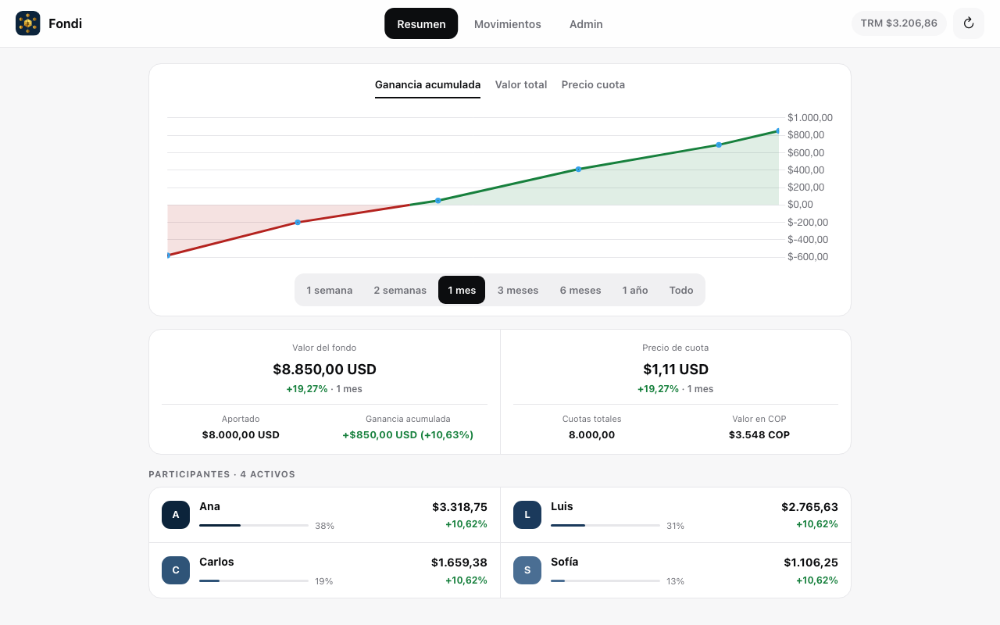
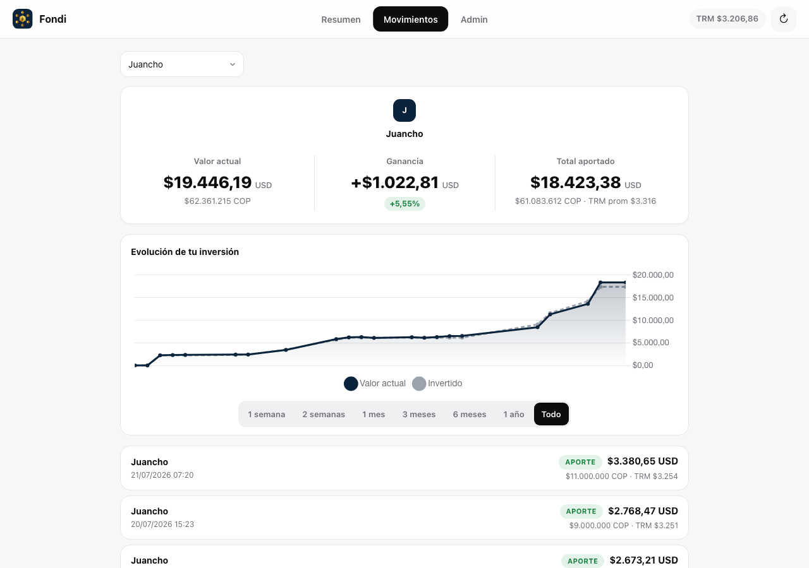
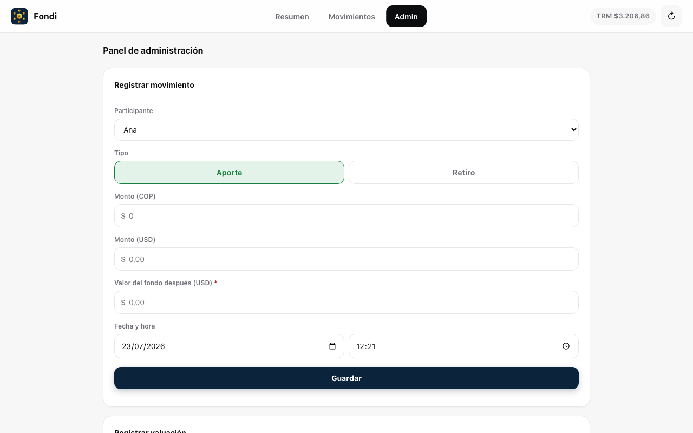
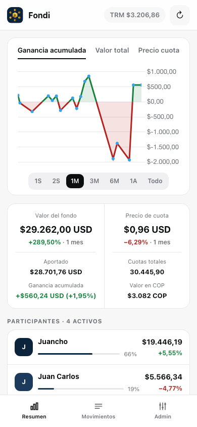
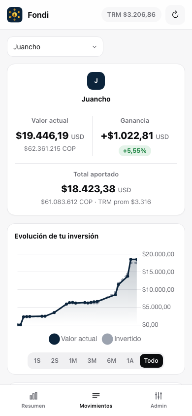
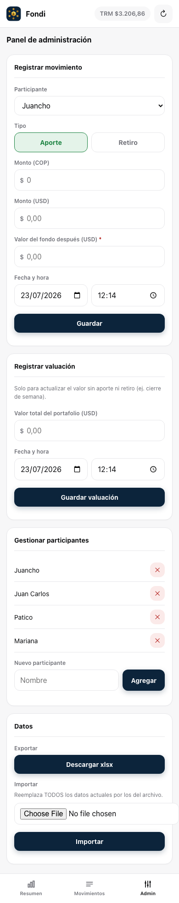

# Fondi

Web dashboard for managing a mutual-fund-style investment pool. Shows fund value, share price, individual ownership, and returns in USD and COP.

---

## Features

- **Fund overview**: total value, share price, and their % change over a selectable range (1 week to all-time), plus an accumulated-gain view colored green/red by sign.
- **Per-participant tracking**: each person's current value, gain (USD and COP), total contributed, and an independent investment-evolution chart with its own date range.
- **Movements log**: full history of contributions/withdrawals, filterable by participant.
- **Admin panel**: register movements and fund valuations with live previews (real-time TRM, resulting share price) before saving; add/remove participants; export/import all data as `.xlsx`.
- **Live TRM (USD/COP exchange rate)**, fetched automatically from Superfinanciera via datos.gov.co.
- **Mobile-friendly**: responsive layout, bottom tab bar, no pinch-zoom or input-focus-zoom quirks.
- Self-hosted as a single Docker container (FastAPI + SQLite backend, static frontend, no external dependencies beyond the TRM fetch).

---

## Screenshots

### Desktop

**Resumen**


**Movimientos**


**Admin**


### Mobile

<p>
  
  
  
</p>

---

> ## ⚠️ PRIVATE USE ONLY — NO REAL AUTH BOUNDARY
> The Admin panel's password (`ADMIN_PASSWORD`) is checked server-side (`secrets.compare_digest`), so it isn't trivially bypassable from the browser — but there's no rate limiting, no session/token, and the read endpoints (`/api/all`, `/api/export`) require **no auth at all**: anyone who can reach the URL can read every contribution, the fund value, and each person's shares.
>
> **Do not expose this to the public internet** (no open port-forward, no public reverse proxy) without putting your own auth layer in front of it (e.g. a reverse proxy with basic auth, a VPN/Tailscale, etc.), and **always set your own `ADMIN_PASSWORD`** — it defaults to `admin` if unset.

---

## Prerequisites

- Node.js 20+ (only for local frontend development — the production container doesn't need it)
- Python 3.12+ (only for local backend development)
- GitHub account with access to GitHub Container Registry
- Server with Docker + Portainer (or any Docker host)

---

## Architecture

One image, one container: a multi-stage `Dockerfile` builds the Vite frontend, then a Python stage installs FastAPI and serves the built static files alongside the `/api/*` routes from a single `uvicorn` process — no nginx, no second container. Data lives in a SQLite file (`/data/fondi.db` inside the container, meant to be a mounted volume) with three append-only tables: `historial_fondo`, `movimientos`, `participantes_config`.

See `CLAUDE.md` for the full data model, endpoint list, and the non-obvious parts of the share-price math.

---

## 1. Run locally

The frontend and backend run as two separate processes in development.

### Backend

```bash
cd backend
pip install -r requirements-dev.txt
ADMIN_PASSWORD=whatever uvicorn app.main:app --port 8000 --reload
```

### Frontend

```bash
npm install
npm run dev
# Open http://localhost:8080
```

In dev, the frontend talks to `http://localhost:8000` (see `API_BASE_URL` in `src/config.js`) — the backend has CORS enabled for this cross-origin setup. To test the UI without a running backend, set `MOCK_MODE = true` in `src/config.js`.

`npm run build` generates `dist/` (what the Dockerfile copies into the image); `npm run preview` serves it locally to check before deploying.

### Backend tests

```bash
cd backend
python -m pytest
```

### Structure

```
index.html          Markup only, no inline logic or styles
src/
  main.js            Entry point — wires up event listeners and boots the app
  config.js           API_BASE_URL, MOCK_MODE / mock fixtures
  state.js             In-memory state (S) and Chart.js instances
  computed.js            Derived state (share price, shares per participant, ...)
  admin.js                 Admin panel: auth, forms, movement/valuation submission
  style.css
  api/backend.js       fetchAll/postMovimiento/postFondo/postParticipante/exportUrl/postImportXlsx — all I/O
  utils/                Formatters, dates, money inputs
  render/               One module per UI section (summary, movements, charts)
  ui/                   Tabs, chart date range, error banner, refresh
backend/
  app/main.py          FastAPI app: auth dependency, routes, static file mount
  app/db.py            Schema + sqlite3 connection helper
  app/xlsx.py          xlsx export/import format
  tests/               pytest + FastAPI TestClient
```

No framework on the frontend — direct DOM manipulation, split by domain and bundled with Vite.

---

## 2. Docker

### Manual build

```bash
docker build -t fondi .
docker run -p 8080:8000 -e ADMIN_PASSWORD=whatever -v fondi-db:/data fondi
```

### Docker Compose (local)

```bash
docker compose up -d --build
# Open http://localhost:8080
```

Uses `docker-compose.yml` at the repo root (local build, no dependency on GHCR). Set `ADMIN_PASSWORD` in a `.env` file or export it before running — it defaults to `admin` otherwise. To rebuild after a change: `docker compose up -d --build` again; to tear it down, `docker compose down`.

### GitHub Container Registry (GHCR)

The repo includes a workflow at `.github/workflows/docker.yml` that builds and publishes the image automatically on every push to `main` that touches `index.html`, `src/**`, `package.json`, `Dockerfile`, or `backend/**`. In a couple of minutes the image lands at:

```
ghcr.io/<user>/fondi:latest
```

#### Authentication to pull from the server

```bash
# On the server where Docker runs:
echo <GITHUB_PAT> | docker login ghcr.io -u <user> --password-stdin
```

The PAT needs the `read:packages` scope. Create it at:
GitHub → Settings → Developer settings → Personal access tokens

---

## 3. Deploy with Docker Compose (Portainer)

```yaml
services:
  fondi:
    image: ghcr.io/<user>/fondi:latest
    container_name: fondi
    restart: unless-stopped
    environment:
      - ADMIN_PASSWORD=${ADMIN_PASSWORD}
    volumes:
      - fondi-db:/data
    networks:
      - proxy

networks:
  proxy:
    external: true

volumes:
  fondi-db:
```

> The `proxy` network must already exist (Traefik or another reverse proxy) and must be told to route to container port **8000** — this app has no built-in port publishing in this example, the proxy talks to it over the shared network. Without the `fondi-db` volume, the SQLite database is wiped every time the container is recreated.

---

## 4. Workflow to update the app

```bash
# Edit code under src/ or backend/
git add -A
git commit -m "feat: description of the change"
git push
# The GitHub Actions workflow rebuilds the image (npm run build + pip install inside the Dockerfile)
# Then in Portainer (or docker compose pull && docker compose up -d): pull the new image + recreate the container
```

**A plain restart/recreate is not enough to pick up a new image** — Docker won't re-fetch an already-pulled `:latest` tag on its own. Always pull explicitly (`docker compose pull`, or Portainer's "re-pull image" option) before recreating.

---

## Notes

- **TRM (exchange rate)**: fetched automatically from [datos.gov.co](https://www.datos.gov.co/resource/32sa-8pi3.json) (Superfinanciera Colombia, official TRM), with a fallback to 4000 if the fetch fails.
- **`ADMIN_PASSWORD`**: checked server-side with `secrets.compare_digest` on every write request (no session/token — each request is validated independently). Defaults to `admin` if unset; always override it before exposing this beyond your LAN.
- **Data model**: three append-only SQLite tables (no `UPDATE`/`DELETE` — corrections are new rows). See `CLAUDE.md` for the full schema and the share-price math.
- **Export/Import**: `GET /api/export` streams an `.xlsx` snapshot (no auth, same as reads); `POST /api/import` replaces all data from an uploaded workbook (requires `ADMIN_PASSWORD`, destructive — confirmed client-side before firing).
