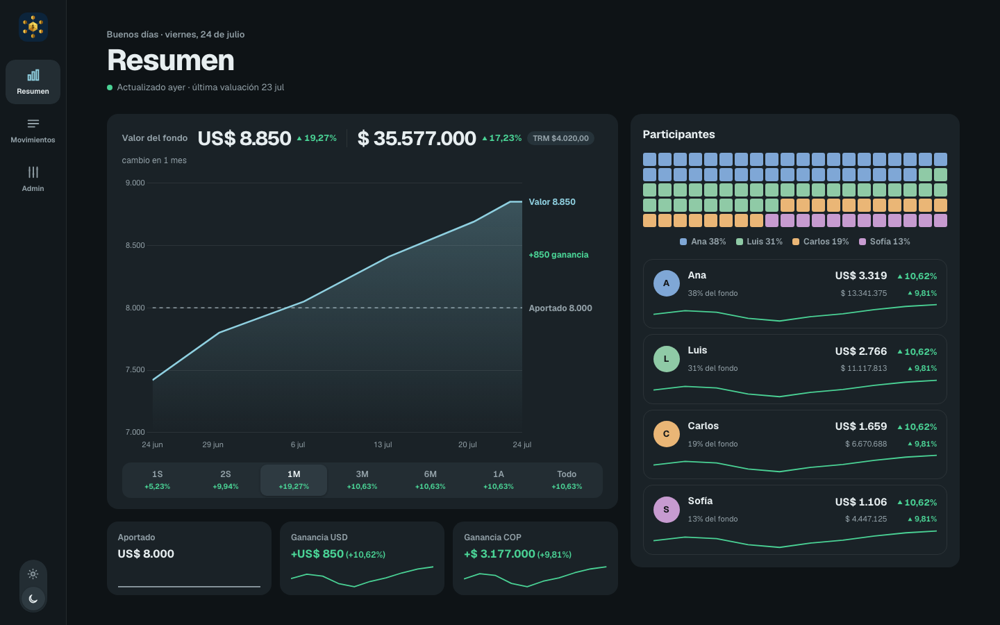
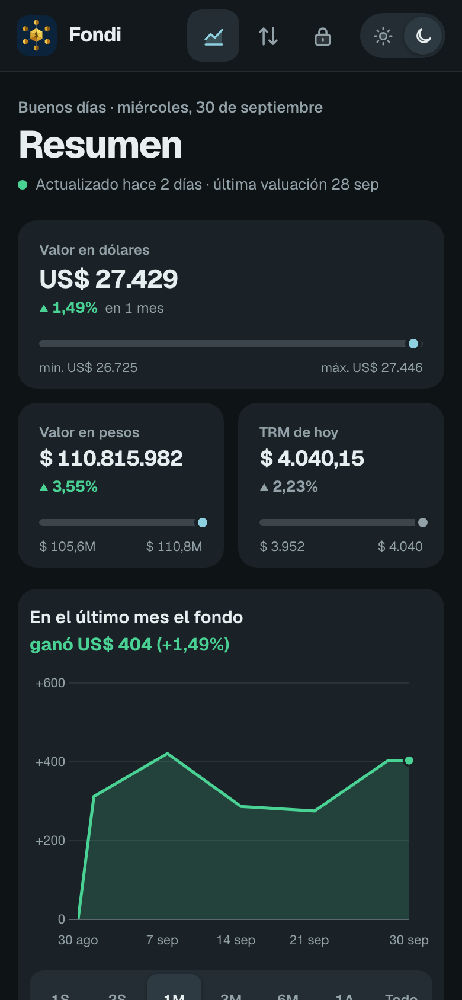
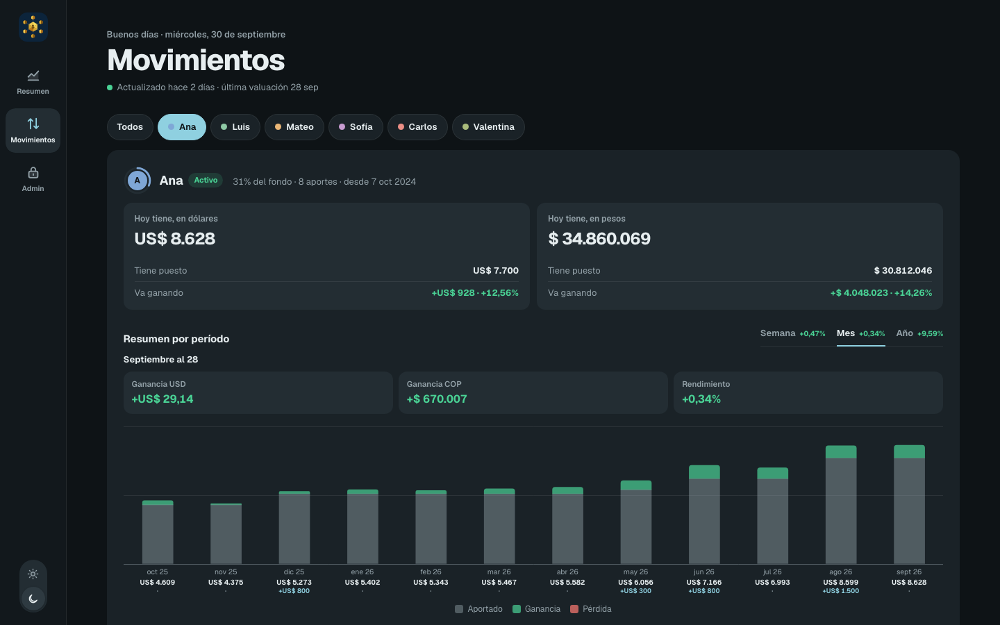
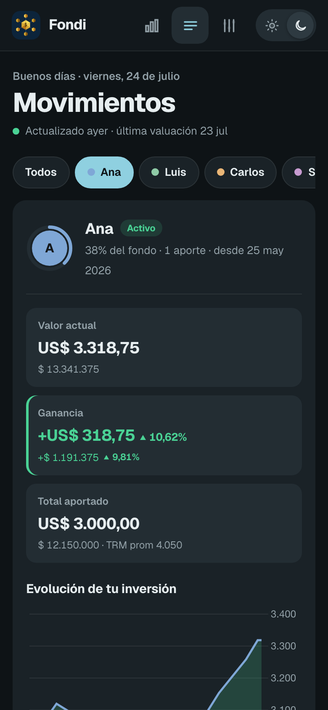
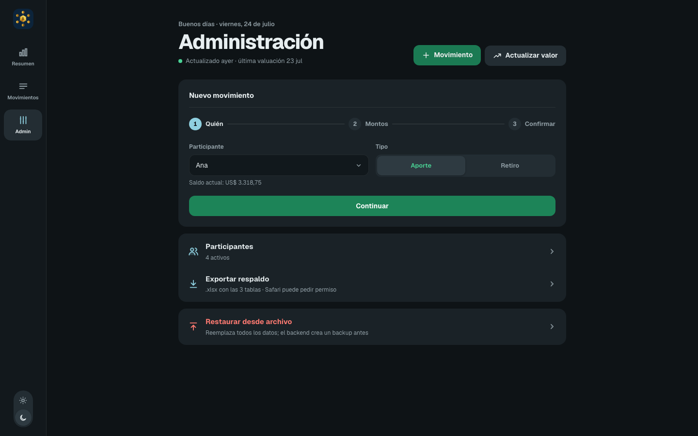
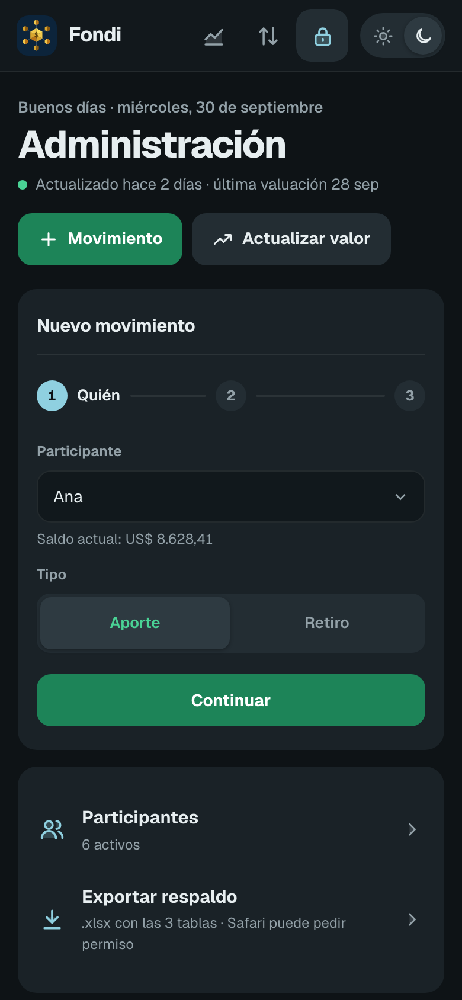

<div align="center">


# Fondi

**A shared investment pool, run like a mutual fund.**

 React &nbsp;·&nbsp;  TypeScript &nbsp;·&nbsp;  FastAPI &nbsp;·&nbsp;  SQLite &nbsp;·&nbsp;  Docker

[Features](#features) · [Docs](docs/ARCHITECTURE.md) · [License](LICENSE)

</div>

**The problem:** pooling money with family in a spreadsheet works until someone joins late. Splitting gains by hand either shortchanges the early members or gives newcomers a free ride.

**What Fondi does:** it runs the pool like a mutual fund. Money in or out converts to shares at the share price right before the movement, so each person's stake is just their share count and gains split themselves, in USD and COP.

<!-- demo-video:start -->
https://github.com/user-attachments/assets/dad26a1d-c2f3-40fc-845d-3de9d9268754
<!-- demo-video:end -->



> [!WARNING]
> Private use only. The read endpoints have no auth: anyone who can reach the URL sees every figure. Keep it on your LAN or behind a VPN, and set `ADMIN_PASSWORD`. Details in [Security](#security).

[Features](#features) · [How do I…](#how-do-i) · [Running](#running) · [Configuration](#configuration) · [Documentation](#documentation) · [Security](#security)

## Features

**Resumen**

- Value vs. contributed chart with every movement marked
- Hover the chart to see the fund on any past date
- Ownership waffle and a card per participant

<table><tr>
<td width="74%"></td>
<td></td>
</tr></table>

**Movimientos**

- Per-person value, gain and total contributed
- Personal chart with its own date range
- Timeline grouped by month, with search and filters

<table><tr>
<td width="74%"></td>
<td></td>
</tr></table>

**Admin**

- Three-step movement form with a share-math receipt
- Valuations, participants, `.xlsx` export and import
- Server-side password with rate limiting

<table><tr>
<td width="74%"></td>
<td></td>
</tr></table>

Screenshots use placeholder data, not a real fund.

## How do I…

### Register a contribution
Admin → Movimiento → pick the person, type the USD amount, the COP you paid and the fund value right after. The confirmation step shows the shares bought and the ownership before and after.

### Update the fund value
Admin → Actualizar valor → type the total the broker shows. Only the share price changes; nobody's share count does.

### Hide someone who left
Admin → Participantes. Removing a person takes them out of the movement form; hiding them takes them out of Resumen and Movimientos. Neither deletes their history or shares.

### Fix a wrong entry
Export the `.xlsx` (Admin → Exportar respaldo), edit the row, and import it back (Admin → Restaurar desde archivo). A database backup is taken before every import.

## Running

| I want to… | Run |
|---|---|
| Try it | `docker run -p 8080:8000 -e ADMIN_PASSWORD=change-me -v fondi-db:/data ghcr.io/juanhdzma/fondi:latest` |
| Work on the frontend | `npm install && npm run dev` (backend on :8000, see [docs/DEVELOPMENT.md](docs/DEVELOPMENT.md)) |
| Work on the backend | `cd backend && uvicorn app.main:app --port 8000 --reload` |
| Deploy | A Portainer stack with the compose file in [docs/DEPLOYMENT.md](docs/DEPLOYMENT.md) |

## Configuration

Copy `.env.example` to `.env`. Everything has a default; only the password matters. The full list is in [docs/DEPLOYMENT.md](docs/DEPLOYMENT.md#configuration).

```bash
ADMIN_PASSWORD=change-me   # Admin panel password. Defaults to "admin".
TRUST_PROXY=               # Set to 1 only behind a reverse proxy.
BACKUP_INTERVAL_H=24       # Hours between DB snapshots. 0 disables them.
LOG_LEVEL=INFO             # Backend log level.
```

## Documentation

| Doc | Read it when |
|---|---|
| [Architecture](docs/ARCHITECTURE.md) | You want to know how it works and why it's built this way |
| [Deployment](docs/DEPLOYMENT.md) | You're running it on a server, upgrading or restoring a backup |
| [Development](docs/DEVELOPMENT.md) | You're changing code: setup, tests, conventions |

## Security

Fondi is built for a trusted home network, not the public internet.

- **Reads are public.** `GET /api/all` and `/api/export` need no auth: anyone who can reach the URL can read every contribution, the fund value and each person's shares.
- **Writes need `ADMIN_PASSWORD`**, checked server-side on every request. It defaults to `admin` so a missing variable never locks you out; set your own.
- **Failed logins are rate-limited** per IP (10 per 5 minutes). Behind a reverse proxy set `TRUST_PROXY=1` so the limit counts real clients; leave it off when the port is exposed directly.

To reach it from outside, put your own auth in front: a VPN such as Tailscale, or a reverse proxy with basic auth.

---

AGPL-3.0 · [LICENSE](LICENSE)
